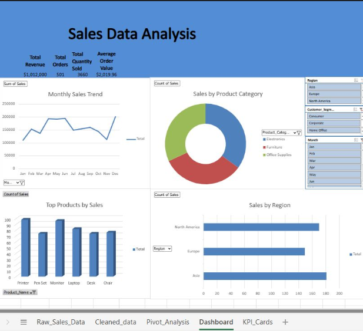

# Sales Data Analysis Dashboard (Excel)

An interactive Excel dashboard analyzing 501 orders and $1,012,000 in revenue.

## Key Findings
- North America led all 3 regions in total sales volume
- Electronics dominated product category revenue
- Sales peaked mid-year then dipped, a clear seasonal trend worth investigating
- Printer was the #1 selling product, outperforming Laptops and Monitors

## What I Built
A 5-tab workbook:
Raw Data -> Cleaned Data -> Pivot Analysis -> Dashboard -> KPI Cards

- KPI summary showing Revenue, Orders, Quantity Sold and AOV at a glance
- Interactive slicers for Region, Customer Segment and Month
- 4 chart types: line trend, donut, horizontal bar, vertical bar

## Skills Applied
Excel, Data Cleaning, PivotTables, KPI Design, Dashboard Layout, Data Storytelling
